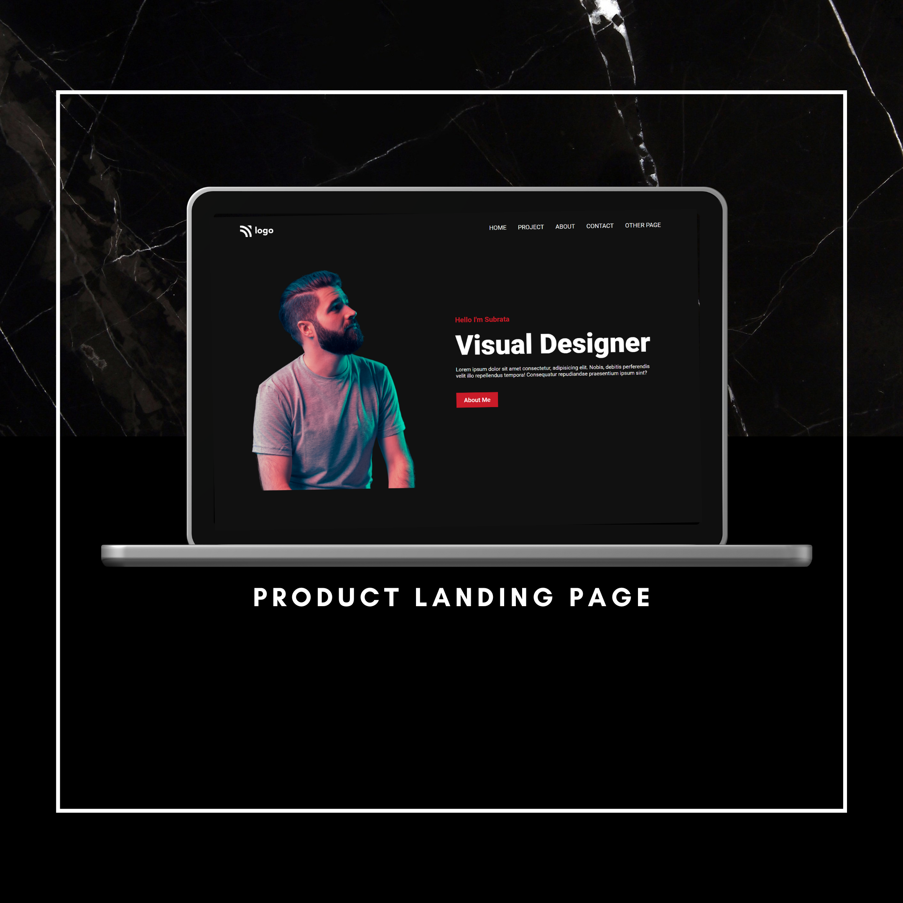
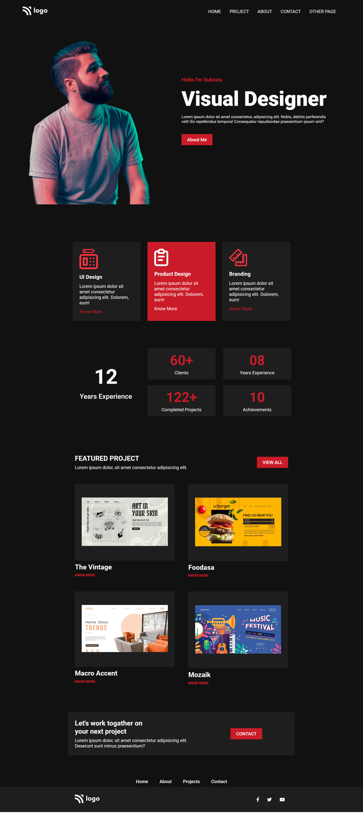

# Product Design Landing Page (UI only)

A landing page to improve CSS skills. All the elements are placed using the position and flex property.

## Key Learnings

- Responsive Design
- Use of media query
- flexbox

## Tech Stack

## Screenshots

## Font Reference

| Font   | Link                                                    |
| ------ | ------------------------------------------------------- |
| Roboto | [Google font](https://fonts.google.com/specimen/Roboto) |

## Color Reference

| Color | Hex                                                              |
| ----- | ---------------------------------------------------------------- |
| Red   |  #c91b28 |
| White |  #f5f2f0 |
| Black |  #111111 |

# Hi, I'm Subrata! 👋

## 🚀 About Me

A passionate frontend developer from India. Currently pursing Bachlor in Technology in Computer Science and Engineering.

## 🔗 Contact Me

